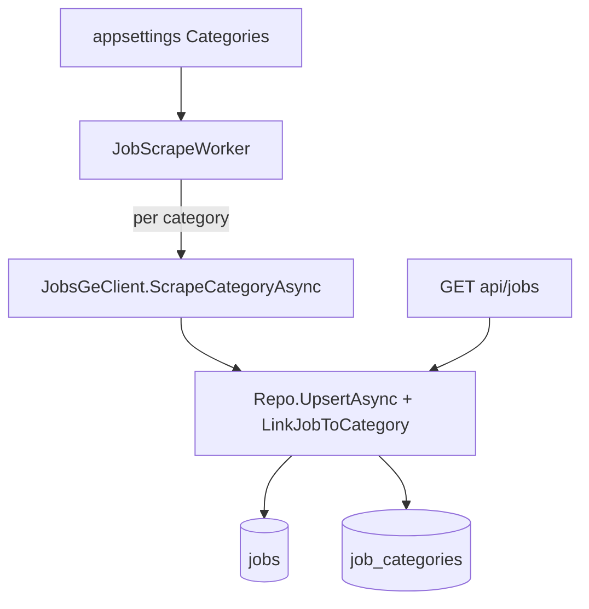

# JobsGeParser

A minimal ASP.NET Core API that scrapes [jobs.ge](https://jobs.ge/) job listings by category, fetches each job's description, and persists results in PostgreSQL. A background worker scrapes each enabled category on a configurable interval.

## Tech stack

| Layer | Choice |
|-------|--------|
| Runtime | .NET 8 (`net8.0`) |
| API style | Minimal hosting (`WebApplication`) + extension methods |
| HTML parsing | [HtmlAgilityPack](https://html-agility-pack.net/) 1.11.x |
| Storage | PostgreSQL via EF Core 8 + Npgsql |
| Background jobs | `BackgroundService` (`JobScrapeWorker`) |
| CI | GitHub Actions — `dotnet publish` on `master` |

## Solution layout

```
JobsGeParser/
├── JobsGeParser.sln
├── Readme.MD
├── docs/plans/               # Plan archive (implemented + planned)
├── AGENTS.md
├── .cursor/
└── JobsGeParser/
    ├── Program.cs
    ├── CategorySync.cs
    ├── Repo.cs
    ├── JobsGeClient.cs
    ├── Workers/JobScrapeWorker.cs
    ├── Data/
    └── Endpoints/Jobs.cs
```

## Architecture



### Scrape flow

1. `JobScrapeWorker` fires on `ScrapeIntervalMinutes`.
2. For each **enabled category** in config:
   - Start a `scrape_runs` row with `CategorySlug`
   - `JobsGeClient.ScrapeCategoryAsync` GETs that category's `ListUrl`
   - For each job: fetch detail, upsert, link to category
   - Live progress written to `scrape_runs` after each job
3. Categories synced from appsettings on every startup (`CategorySync`).

### Job–category model

- **Many-to-many** via `job_categories` — a job can belong to multiple categories if it appears in multiple listings.
- Job content upsert is still keyed on jobs.ge `Id`; category links are updated separately.

## Configuration

```json
{
  "JobsGeParserOptions": {
    "BaseUrl": "https://jobs.ge/",
    "Categories": [
      {
        "Slug": "it",
        "Name": "IT / Programming",
        "ListUrl": "?page=1&q=&cid=6&lid=1&jid=1",
        "Enabled": true
      }
    ],
    "ScrapeEnabled": true,
    "ScrapeIntervalMinutes": 60,
    "ScrapeOnStartup": false,
    "DetailPageDelayMs": 500
  }
}
```

| Setting | Purpose |
|---------|---------|
| `Categories` | List of scrape targets (slug, name, list URL, enabled) |
| `Categories[].Slug` | Stable key for filtering (e.g. `it`) |
| `Categories[].ListUrl` | Relative listing URL on jobs.ge |
| `ScrapeEnabled` | Kill switch for background scraping |
| `ScrapeIntervalMinutes` | Minutes between scrape ticks (all categories per tick) |
| `DetailPageDelayMs` | Delay between detail-page requests |

Add more categories by appending entries with their jobs.ge list URLs.

## API endpoints

Base URL (development): `http://localhost:50423`

### Jobs

| Method | Route | Behavior |
|--------|-------|----------|
| `GET` | `/api/jobs/categories` | All categories (slug, name, enabled) |
| `GET` | `/api/jobs/?category={slug}` | Jobs in category (omit `category` for all) |
| `GET` | `/api/jobs/dotnet?category={slug}` | `.net` title filter + optional category |

### Scrape management

| Method | Route | Behavior |
|--------|-------|----------|
| `GET` | `/api/jobs/scrape/overview` | **Full picture**: worker state, active runs, latest per category, recent runs & batches |
| `GET` | `/api/jobs/scrape/worker` | Live background worker state (current tick, category, run id) |
| `GET` | `/api/jobs/scrape/runs` | Paginated run history (`?status`, `?category`, `?batchId`, `?limit`, `?offset`) |
| `GET` | `/api/jobs/scrape/runs/active` | All runs with status `Running` |
| `GET` | `/api/jobs/scrape/runs/{id}` | Single scrape run by id |
| `GET` | `/api/jobs/scrape/batches` | Recent scrape ticks (grouped runs sharing a `batchId`) |
| `GET` | `/api/jobs/scrape/batches/{batchId}` | All runs in one tick |
| `GET` | `/api/jobs/scrape/status` | Latest run per enabled category (legacy shortcut) |
| `GET` | `/api/jobs/scrape/status/{slug}` | Latest run for one category |

## Database

Tables: `jobs`, `categories`, `job_categories`, `scrape_runs`.

Migrations:

```bash
dotnet ef database update --project JobsGeParser/JobsGeParser.csproj --startup-project JobsGeParser/JobsGeParser.csproj
```

On startup: categories synced from config; existing jobs without a category are backfilled to `it`.

## Development

```bash
dotnet run --project JobsGeParser/JobsGeParser.csproj
```

Set PostgreSQL connection string in `appsettings.Development.json`.

## Plans

See [`docs/plans/`](docs/plans/) for archived implementation plans.

## AI assistant context

Project-specific Cursor rules and skills live under `.cursor/`. See [AGENTS.md](AGENTS.md).
