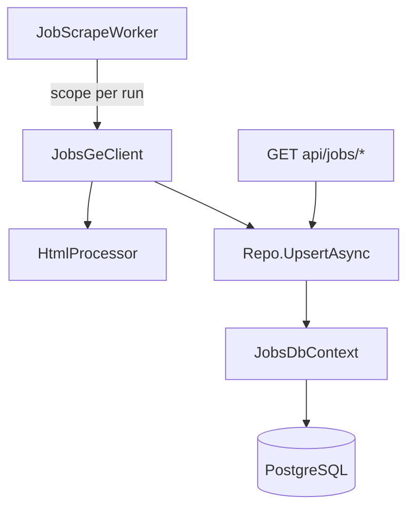

# JobsGeParser

A minimal ASP.NET Core API that scrapes [jobs.ge](https://jobs.ge/) IT job listings, fetches each job's description, and persists results in PostgreSQL. A background worker scrapes on a configurable interval.

## Tech stack

| Layer | Choice |
|-------|--------|
| Runtime | .NET 8 (`net8.0`) |
| API style | Minimal hosting (`WebApplication`) + extension methods |
| HTML parsing | [HtmlAgilityPack](https://html-agility-pack.net/) 1.11.x |
| Storage | PostgreSQL via EF Core 8 + Npgsql |
| Background jobs | `BackgroundService` (`JobScrapeWorker`) |
| CI | GitHub Actions — `dotnet publish` on `master` |

## Solution layout

```
JobsGeParser/
├── JobsGeParser.sln
├── Readme.MD
├── AGENTS.md
├── .cursor/                  # Project rules and skills
└── JobsGeParser/
    ├── Program.cs
    ├── Ext.cs
    ├── Repo.cs               # EF-backed upsert + queries
    ├── JobsGeClient.cs       # Scrape orchestration
    ├── Workers/JobScrapeWorker.cs
    ├── Data/
    │   ├── JobsDbContext.cs
    │   ├── JobEntity.cs
    │   ├── ScrapeRunEntity.cs
    │   └── Migrations/
    ├── Endpoints/Jobs.cs
    ├── appsettings.json
    └── JobsGeParser.http
```

## Architecture



### Dependency injection (`Ext.AddJobsGeService`)

| Service | Lifetime |
|---------|----------|
| `JobsGeParserOptions` | Singleton |
| `JobsDbContext` | Scoped |
| `Repo` | Scoped |
| `JobsGeClient` | Scoped |
| `HtmlProcessor` | Singleton |
| `JobScrapeWorker` | Hosted service |

### Scrape flow (background worker)

1. `JobScrapeWorker` fires on `ScrapeIntervalMinutes` (or on startup if `ScrapeOnStartup` is true).
2. Creates a DI scope; records a `scrape_runs` row with status `Running`.
3. `JobsGeClient.ScrapeAsync` GETs the listing page, parses jobs, then for each job GETs the detail page.
4. `Repo.UpsertAsync` inserts, updates, or skips based on jobs.ge `Id` and field comparison.
5. 500 ms delay between detail requests (`DetailPageDelayMs`).
6. Run marked `Completed` or `Failed` with counts.

### Idempotent upsert

Primary key is jobs.ge `Id` (from link query `id=`).

| Case | Action |
|------|--------|
| **Insert** | New `Id` — insert row; set `FirstSeenAt` and `LastSeenAt` |
| **Skip** | Same `Id`, identical fields — update `LastSeenAt` only |
| **Update** | Same `Id`, any field changed — overwrite fields; set `LastSeenAt` and `UpdatedAt` |

Compared fields: `Name`, `Link`, `Company`, `CompanyLink`, `Published`, `EndDate`, `Description`.

## Configuration

`appsettings.json`:

```json
{
  "ConnectionStrings": {
    "JobsGeParser": "Host=localhost;Port=5432;Database=jobsgeparser;Username=postgres;Password=postgres"
  },
  "Database": {
    "AutoMigrate": false
  },
  "JobsGeParserOptions": {
    "BaseUrl": "https://jobs.ge/",
    "JobsListUrl": "?page=1&q=&cid=6&lid=1&jid=1",
    "ScrapeEnabled": true,
    "ScrapeIntervalMinutes": 60,
    "ScrapeOnStartup": false,
    "DetailPageDelayMs": 500
  }
}
```

| Setting | Purpose |
|---------|---------|
| `ConnectionStrings:JobsGeParser` | PostgreSQL connection |
| `Database:AutoMigrate` | Apply EF migrations on startup (true in Development) |
| `ScrapeEnabled` | Enable/disable background scraping |
| `ScrapeIntervalMinutes` | Minutes between scrape runs |
| `ScrapeOnStartup` | Run one scrape when the app starts |
| `DetailPageDelayMs` | Delay between detail-page HTTP requests |

Override via environment variables: `ConnectionStrings__JobsGeParser`, `JobsGeParserOptions__ScrapeIntervalMinutes`, etc.

## API endpoints

Base URL (development): `http://localhost:50423`

| Method | Route | Behavior |
|--------|-------|----------|
| `GET` | `/api/jobs/` | All jobs from PostgreSQL |
| `GET` | `/api/jobs/dotnet` | Jobs whose title contains `.net` |
| `GET` | `/api/jobs/scrape/status` | Latest scrape run (counts, status, timestamps) |

Scraping is automatic via `JobScrapeWorker` — there is no manual retrieve endpoint.

Use `JobsGeParser/JobsGeParser.http` for manual testing.

## Database setup

### Prerequisites

- PostgreSQL instance with database `jobsgeparser` created
- [.NET 8 SDK](https://dotnet.microsoft.com/download/dotnet/8.0)

### Migrations

From solution root:

```bash
dotnet ef database update --project JobsGeParser/JobsGeParser.csproj --startup-project JobsGeParser/JobsGeParser.csproj
```

In Development, `Database:AutoMigrate` is `true` in `appsettings.Development.json` — migrations apply on startup.

Production: run `dotnet ef database update` in your deploy pipeline.

### Tables

- **`jobs`** — scraped job listings (PK = jobs.ge id)
- **`scrape_runs`** — background scrape history and counts

## Development

```bash
dotnet run --project JobsGeParser/JobsGeParser.csproj
```

Set your PostgreSQL connection string in `appsettings.Development.json` or via `ConnectionStrings__JobsGeParser` env var.

With `ScrapeOnStartup: true` in Development, the first scrape begins when the app starts.

## Conventions for future changes

1. **DI** — register in `Ext.AddJobsGeService`; keep `Program.cs` thin.
2. **Endpoints** — read-only routes in `Endpoints/Jobs.cs`; scraping stays in `JobScrapeWorker`.
3. **Parsing** — `HtmlProcessor`; HTTP orchestration — `JobsGeClient`; persistence — `Repo`.
4. **New config** — `JobsGeParserOptions` + `appsettings.json` + validation in `Ext`.
5. **DbContext** — scoped; use `IServiceScopeFactory` in hosted services.

## Known limitations

| Item | Notes |
|------|-------|
| Single listing page | Only `JobsListUrl` page is scraped |
| Per-job errors swallowed | Failed detail fetches increment `Failed` count; scrape continues |
| Backup `.csproj` files | Safe to delete |
| `dotnet-desktop.yml` | Unused CI template |

## AI assistant context

Project-specific Cursor rules and skills live under `.cursor/`. See [AGENTS.md](AGENTS.md).
