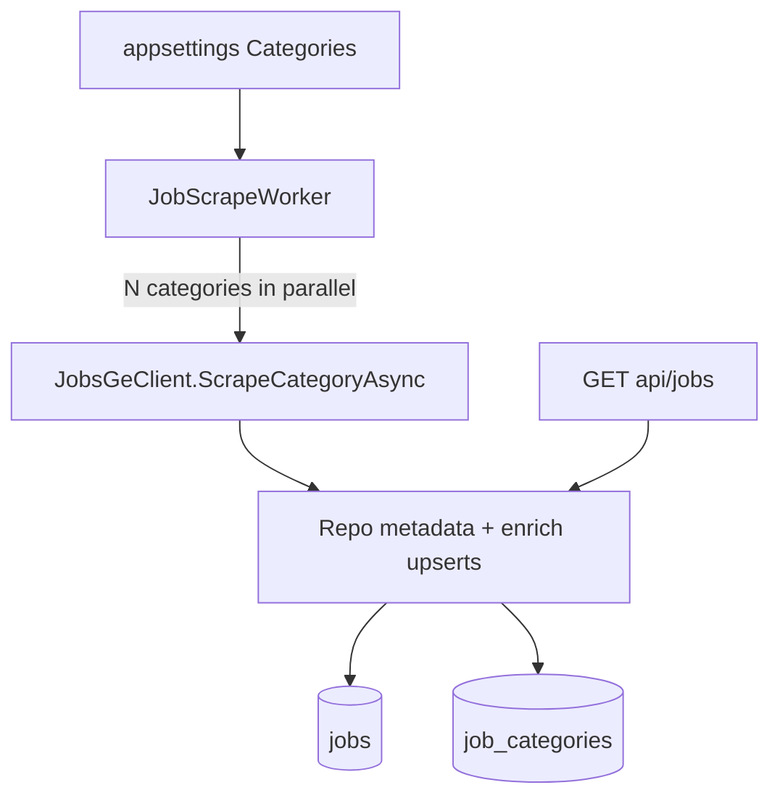

# JobsGeParser

A minimal ASP.NET Core API that scrapes [jobs.ge](https://jobs.ge/) job listings by category, fetches each job's description, and persists results in PostgreSQL. A background worker scrapes each enabled category on a configurable interval.

## Tech stack

| Layer | Choice |
|-------|--------|
| Runtime | .NET 8 (`net8.0`) |
| API style | Minimal hosting (`WebApplication`) + extension methods |
| HTML parsing | [HtmlAgilityPack](https://html-agility-pack.net/) 1.11.x |
| Storage | PostgreSQL via EF Core 8 + Npgsql |
| Background jobs | `BackgroundService` (`JobScrapeWorker`) |
| CI | GitHub Actions — `dotnet publish` on `master` |

## Solution layout

This folder is the **backend** project. The React dashboard lives in [`../frontend/`](../frontend/). Repo overview: [`../README.md`](../README.md).

```
backend/
├── JobsGeParser.sln
├── README.md                 # this file
└── JobsGeParser/
    ├── Program.cs
    ├── Configuration/
    ├── Data/
    ├── Scraping/
    ├── Workers/
    └── Endpoints/
```

Full monorepo layout:

```
JobsGeParser/                 # repository root
├── README.md
├── AGENTS.md
├── docs/plans/               # backend implementation plans
├── .cursor/
├── backend/                  # ← you are here
│   ├── JobsGeParser.sln
│   └── JobsGeParser/
└── frontend/                 # React dashboard
    └── src/
```

## Architecture



### Scrape flow

1. `JobScrapeWorker` fires on `ScrapeIntervalMinutes`.
2. Enabled categories are enqueued to a bounded `Channel`; **M parallel category consumers** run at once (`CategoryScrapeConcurrency`).
3. Per category:
   - Start a `scrape_runs` row with `CategorySlug`
   - **Discover:** GET listing → parse metadata → `UpsertMetadataAndLinkCategoryAsync` for every row
   - **Enrich:** only jobs that are new, metadata-changed, or missing `DetailsFetchedAt` are enqueued to a job `Channel`
   - **N parallel enrich consumers** fetch detail pages (bounded by `DetailFetchConcurrency`) → `UpsertDescriptionAsync`
   - Progress written every `ProgressUpdateInterval` enriched jobs (plus final flush)
   - Run counters include `detailsFetched` and `detailsSkipped` (detail HTTP skipped when metadata unchanged)
4. HTTP requests throttled globally via `ScrapeRequestThrottle` (shared across all categories and detail workers)
5. Categories synced from appsettings on every startup (`CategorySync`).

Only one app instance should scrape in dev/prod — multiple instances with `ScrapeEnabled: true` duplicate HTTP load.

### Job–category model

- **Many-to-many** via `job_categories` — a job can belong to multiple categories if it appears in multiple listings.
- Job content upsert is still keyed on jobs.ge `Id`; category links are updated separately.

## Configuration

```json
{
  "JobsGeParserOptions": {
    "BaseUrl": "https://jobs.ge/",
    "Categories": [
      {
        "Slug": "it",
        "Name": "IT / Programming",
        "ListUrl": "?page=1&q=&cid=6&lid=1&jid=1",
        "Enabled": true
      }
    ],
    "ScrapeEnabled": true,
    "ScrapeIntervalMinutes": 60,
    "ScrapeOnStartup": false,
    "DetailPageDelayMs": 500,
    "DetailFetchConcurrency": 3,
    "CategoryScrapeConcurrency": 5,
    "ProgressUpdateInterval": 5,
    "DefaultJobsPageSize": 20,
    "MaxJobsPageSize": 100
  }
}
```

| Setting | Purpose |
|---------|---------|
| `Categories` | List of scrape targets (slug, name, list URL, enabled) |
| `Categories[].Slug` | Stable key for filtering (e.g. `it`) |
| `Categories[].ListUrl` | Relative listing URL on jobs.ge |
| `ScrapeEnabled` | Kill switch for background scraping |
| `ScrapeIntervalMinutes` | Minutes between scrape ticks (all categories per tick) |
| `DetailPageDelayMs` | Minimum ms between HTTP request starts (global across all parallel workers) |
| `DetailFetchConcurrency` | Max parallel detail-page fetches per category (default 3) |
| `CategoryScrapeConcurrency` | Max categories scraped in parallel per tick (default 5) |
| `ProgressUpdateInterval` | Update `scrape_runs` counts every N completed jobs (default 5) |
| `DefaultJobsPageSize` | Default page size for `GET /api/jobs` (default 20) |
| `MaxJobsPageSize` | Maximum allowed `pageSize` query param (default 100) |

Add more categories by appending entries with their jobs.ge list URLs.

## API endpoints

Base URL (development): `http://localhost:50423`

### Jobs

| Method | Route | Behavior |
|--------|-------|----------|
| `GET` | `/api/jobs/categories` | Categories with `jobCount` and `latestScrapeRun` per slug |
| `GET` | `/api/jobs` | Paginated job list (`?page`, `?pageSize`, `?category`, `?q`) — no descriptions |
| `GET` | `/api/jobs/{id}` | Single job with full description and category slugs |
| `GET` | `/api/jobs/dotnet` | Paginated `.net` title filter (same query params as list) |

### Scrape management

| Method | Route | Behavior |
|--------|-------|----------|
| `GET` | `/api/jobs/scrape/overview` | **Full picture**: worker state, active runs, latest per category, recent runs & batches |
| `GET` | `/api/jobs/scrape/worker` | Live background worker state (current tick, category, run id) |
| `GET` | `/api/jobs/scrape/runs` | Paginated run history (`?status`, `?category`, `?batchId`, `?limit`, `?offset`) |
| `GET` | `/api/jobs/scrape/runs/active` | All runs with status `Running` |
| `GET` | `/api/jobs/scrape/runs/{id}` | Single scrape run by id |
| `GET` | `/api/jobs/scrape/batches` | Recent scrape ticks (grouped runs sharing a `batchId`) |
| `GET` | `/api/jobs/scrape/batches/{batchId}` | All runs in one tick |
| `GET` | `/api/jobs/scrape/status` | Latest run per enabled category (legacy shortcut) |
| `GET` | `/api/jobs/scrape/status/{slug}` | Latest run for one category |

## Database

Tables: `jobs`, `categories`, `job_categories`, `scrape_runs`.

Migrations:

```bash
dotnet ef database update --project JobsGeParser/JobsGeParser.csproj --startup-project JobsGeParser/JobsGeParser.csproj
```

Run from the `backend/` directory, or prefix paths with `backend/` from the repo root.

On startup: categories synced from config; existing jobs without a category are backfilled to `it`.

## Development

```bash
dotnet run --project JobsGeParser/JobsGeParser.csproj
```

Set PostgreSQL connection string in `JobsGeParser/appsettings.Development.json`.

### Dashboard UI

The React dashboard is in [`../frontend/`](../frontend/). Start it separately:

```bash
cd ../frontend
npm install
npm run dev
```

Open `http://localhost:5173`. See [frontend/README.md](../frontend/README.md).

**Production hosting (optional):**

- **Single host:** Build with `cd frontend && npm run build`, copy `frontend/dist` to `JobsGeParser/wwwroot`, and add `UseStaticFiles` + `MapFallbackToFile` in `Program.cs`
- **Separate host:** Add a CORS policy in `Configuration/DependencyInjection.cs` for the UI origin

## Plans

See [`../docs/plans/`](../docs/plans/) for archived backend implementation plans.

## AI assistant context

Project-specific Cursor rules and skills live under [`../.cursor/`](../.cursor/). See [AGENTS.md](../AGENTS.md).
